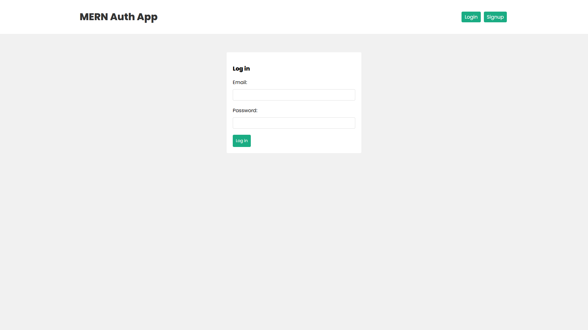

<h2 align="center">🔐 Auth Application 🛅</h2>

• 📢 Auth apllication create with React, Node JS, Express JS and Mongo DB.  

 

 
<h2 align="left">Live Preview: 🕹️ </h2>

    
• 🖥️  Auth Application&nbsp;
    
    

<h2 align="left">Languages and Tools : 🛠️ </h2>

    &nbsp;
    &nbsp;
    &nbsp;
    &nbsp;
    &nbsp;
    &nbsp;

<h2 align="left">Settings : ⚙️ </h2>

• 👷  In folder "frontend" create ".env" file with content:  

     
VITE_API_URL="BACKEND_API_URL"   If using proxy server from vite.config.js then ignore this step. 
 

• 👷  In folder "backend" create ".env" file with content:  

    
PORT = PORT   MONGO_URI = MONGO_URL   SECRET =  SECRET_KEY 

<!-- ////////////////////////////////////////////// MERN-Projects/AuthApp ///////////////////////////////////////////////// -->