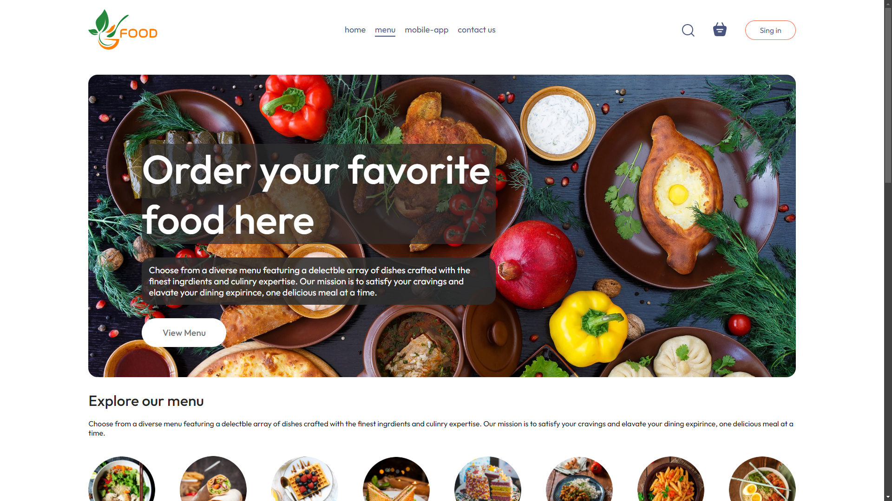

<h2 align="center">🍲 Food Application 🥗</h2>

• 📢 Food apllication create with React, Node JS, Express JS, Mongo DB and Stripe payment platform.  

 

 
<h2 align="left">Live Preview: 🌏 </h2>

    
• 🖥️  Food Application&nbsp;
    
    

<h2 align="left">Languages and Tools : 🛠️ </h2>

    &nbsp;
    &nbsp;
    &nbsp;
    &nbsp;
    &nbsp;
    &nbsp;

<h2 align="left">Settings : ⚙️ </h2>

• 👷  In folder "admin" create ".env" file with content: 

    
VITE_API_URL="BACKEND_API_URL"   VITE_FRONTEND_URL="FRONTEND_URL" 
 

• 👷  In folder "frontend" create ".env" file with content:  

     
VITE_API_URL="BACKEND_API_URL"   VITE_ADMIN_URLL="ADMIN_URL" 
 

• 👷  In folder "backend" create ".env" file with content:  

    
FRONTEND_URL="FRONTEND_URL"   STRIPE_SECRET_KEY="STRIPE_KEY"

• 👷  In folder "backend" in pkg folder create new folder with name"config" and inside this folder create "config.env" file with content: 

    
DATABASE="mongodb+srv://<"DATABASE_PASSWORD">@MONGO_DB_ADDRESS"   DATABASE_PASSWORD="PASSWORD"  PORT=3000   JWT_SECRET="random#secret"   JWT_COOKIE_EXPIRES=90

<!-- ////////////////////////////////////////////// MERN-Projects/FoodApp ///////////////////////////////////////////////// -->