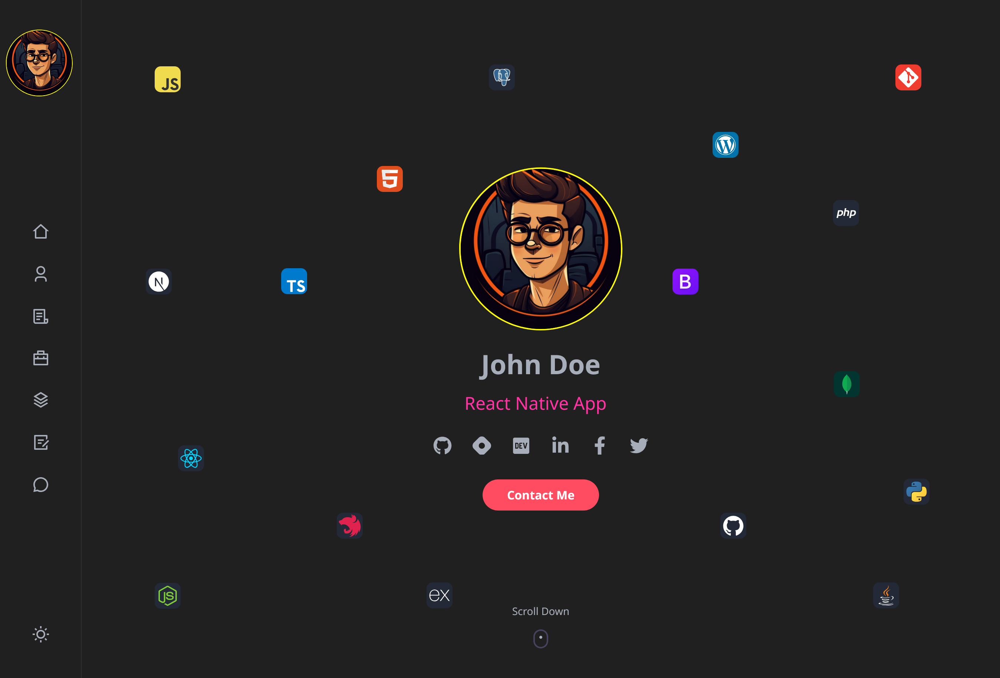

<h2 align="center">🧑 Portfolio Application 👩</h2>

• 📢 Portfolio Web Site made with React, Node JS, Express JS and Twilio API key for send email.  

 

 
<h2 align="left">Live Preview: 🕹️ </h2>

    
• 🖥️  Portfolio Application&nbsp;
    
    

<h2 align="left">Languages and Tools : 🛠️ </h2>

    &nbsp;
    &nbsp;
    &nbsp;
    &nbsp;
    &nbsp;

<h2 align="left">Settings : ⚙️ </h2>

• 👷  In root folder "PortfolioApp" create new file ".env" with content: 

    
SENDGRID_API_KEY = "API_KEY"   EMAIL_TO = "EMAIL_URL"   EMAIL_FROM = "EMAIL_URL"   PORT = "5000"

<!-- ////////////////////////////////////////////// MERN-Projects/PortfolioApp-2 ///////////////////////////////////////////////// -->